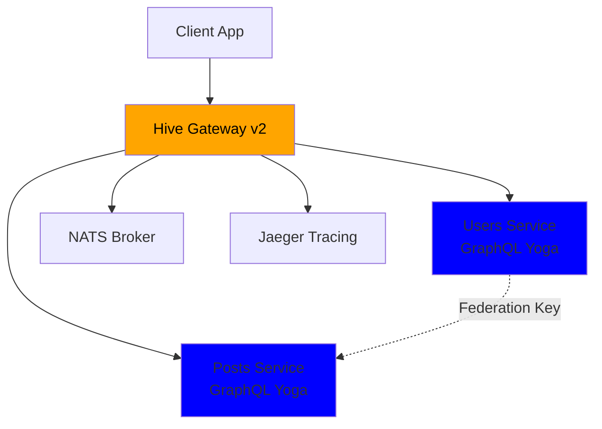
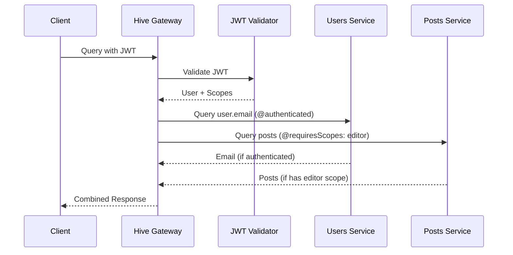
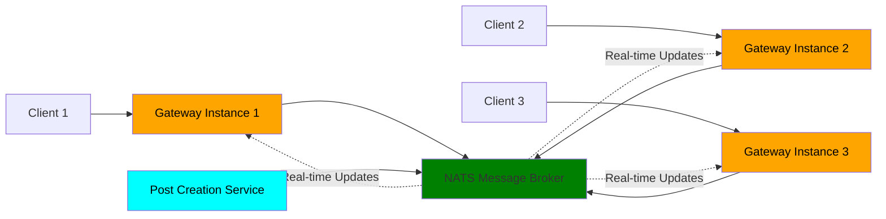

# Unleash the Power of Federation with Hive Gateway v2 🚀

Denis and Arda from The Guild

---
layout: intro
---

# Workshop Overview

## What we'll build together

- Federated GraphQL gateway from scratch
- Production-ready features in 90 minutes
- Real-time subscriptions that scale

## You'll learn

- v2's production capabilities
- Advanced security patterns
- How to build bulletproof GraphQL infrastructure

---
layout: default
---

# What's New in v2

Production-Grade GraphQL Federation

### Key v2 Features

- 🔍 Enhanced OpenTelemetry - Perfect traces with proper setup
- 📊 Dynamic Structured Logging - Change levels without restarts
- 🚀 Event-Driven Subscriptions - Horizontally scalable with NATS
- ⚡ Request Deduplication - Automatic performance optimization
- 🛡️ Advanced Security - JWT, HMAC, field-level authorization

_Built for production workloads from day one_

---
layout: two-cols-header
---

# Our Demo App

Simple Blog Platform

::left::

### Users Service

- User profiles with ID, name, email
- Role-based access control
- Federation key on user ID

### Posts Service

- Blog posts with title and content
- Author relationship via federation
- Real-time post notifications

::right::

## Perfect for demonstrating

- GraphQL Yoga for subgraphs
- Hive Gateway for federation
- JWT authentication + authorization directives
- HMAC signature security
- Real-time subscriptions

## User Roles

- 👑 Admin: Can see all user emails
- ✍️ Editor: Can create/edit posts
- 👤 User: Basic read access

---
layout: default
---

# Workshop Flow

What We'll Build Together

### Part 1: Foundation (20 min)

- Create Users & Posts subgraphs (GraphQL Yoga)
- Bootstrap Hive Gateway v2

### Part 2: Production Features (45 min)

- OpenTelemetry tracing → Jaeger
- Dynamic structured logging (change levels without restarts!)
- JWT authentication + field-level authorization
- HMAC signatures for subgraph security
- Security hardening (rate limits, depth limits)
- Event-Driven Federated Subscriptions

### Part 3: Production Polish (15 min)

- Response caching & deduplication
- Performance monitoring integration

---
layout: default
zoom: 0.8
---

# Federation Architecture

How Our Services Connect

---
layout: two-cols-header
---

# OpenTelemetry Made Simple

Production-Grade Observability

::left::

### What we'll configure

- Gateway tracing with Jaeger integration
- Automatic span creation for GraphQL operations
- Proper span hierarchy across federation
- Contextual data in every trace

::right::

## What you get

- Perfect traces with proper span hierarchy
- Contextual data in every span
- GraphQL context, HTTP details, upstream execution info
- Automatic custom span parenting

### Result

Complete visibility into your federated system 📈

---

# Dynamic Logging Revolution

Change Log Levels Without Restarts 🔄

### We'll demonstrate

- Structured logging with request-level metadata
- Request IDs flowing through entire request lifecycle
- Dynamic log level switching during live operation
- Production debugging without downtime

---
layout: default
zoom: 0.7
---

# Security Flow

Multi-Layer Protection

---
layout: two-cols-header
---

# Multi-Layer Security

JWT + Field-Level Authorization + HMAC

::left::

### Authentication Layer

- JWT token validation
- Support for RS256/HS256 algorithms
- User identity and role extraction

### Authorization Layer

- `@authenticated` directive for basic protection
- `@requiresScopes` directive for role-based access
- Field-level permission control

::right::

## Security Layers

### JWT Authentication

- Validates user identity
- Carries user roles/scopes

### Authorization Directives

- `@authenticated` - requires any valid user
- `@requiresScopes` - requires specific roles

### HMAC Signatures

- Secure subgraph communication
- Protection against tampering

### Introspection

- Available to everyone for development

---
layout: default
---

# Security Features

Production-Grade Protection

### Rate Limiting 🚦

- Global gateway rate limits
- Per-field rate limiting with `@rateLimit` directive
- Prevent abuse and DoS attacks

### Query Protection 🛡️

- Maximum query depth limits
- Query complexity analysis
- Character count restrictions

### Live Demo

We'll try to break our gateway with malicious queries!

---
layout: default
---

# EDFS Architecture

Event-Driven Federated Subscriptions

---
layout: two-cols-header
---

# EDFS - Subscriptions That Scale

Event-Driven Federated Subscriptions

::left::

### Traditional Subscriptions

- Tied to single gateway instance
- Limited scalability
- Single point of failure

### EDFS with v2

- Distributed across multiple gateways
- Horizontal scaling with NATS
- Fault tolerance built-in
- Built-in adapters included

::right::

## What we'll build

- Real-time post notifications
- NATS message broker integration
- Multi-instance subscription handling
- Fault-tolerant messaging

### Perfect for

Real-time features at enterprise scale 🌐

---
layout: center
---

# Let's Build! 🛠️

Follow along or just watch - your choice!

We'll start with an empty directory and build:

1. Two federated GraphQL Yoga subgraphs
2. Production-ready gateway
3. Multi-layer security (JWT + HMAC + field-level auth)
4. Real-time subscriptions with EDFS
5. Full observability stack with Jaeger

Let's unleash the power of federation! 🚀

---

# Resources

Continue Your Journey

### Documentation 📚

- [Hive Gateway Docs](https://the-guild.dev/graphql/hive/docs/gateway)
- [Authentication & Authorization](https://the-guild.dev/graphql/hive/docs/gateway/authorization-authentication)
- [HMAC Security](https://the-guild.dev/graphql/hive/docs/gateway/other-features/security/hmac-signature)
- [EDFS Guide](https://wundergraph.com/blog/distributed_graphql_subscriptions_with_nats_and_event_driven_architecture)

### Get Started

- [GitHub Repository](https://github.com/graphql-hive/gateway)
- [Community Discord](https://discord.gg/graphql)

---
layout: end
---

# Thank You!

Questions? 🤔
