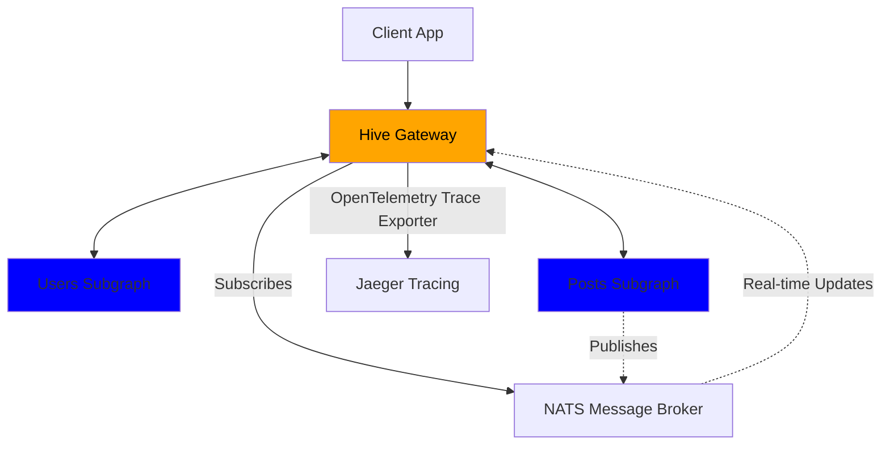
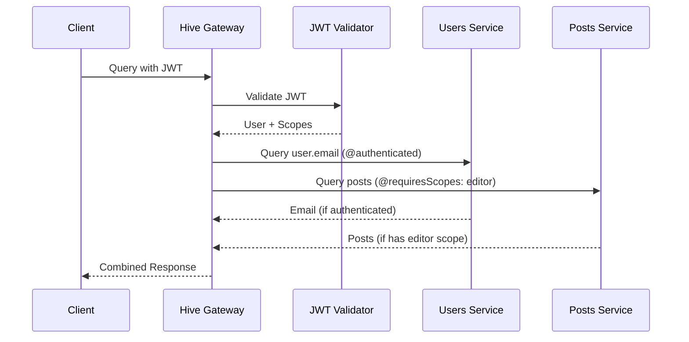
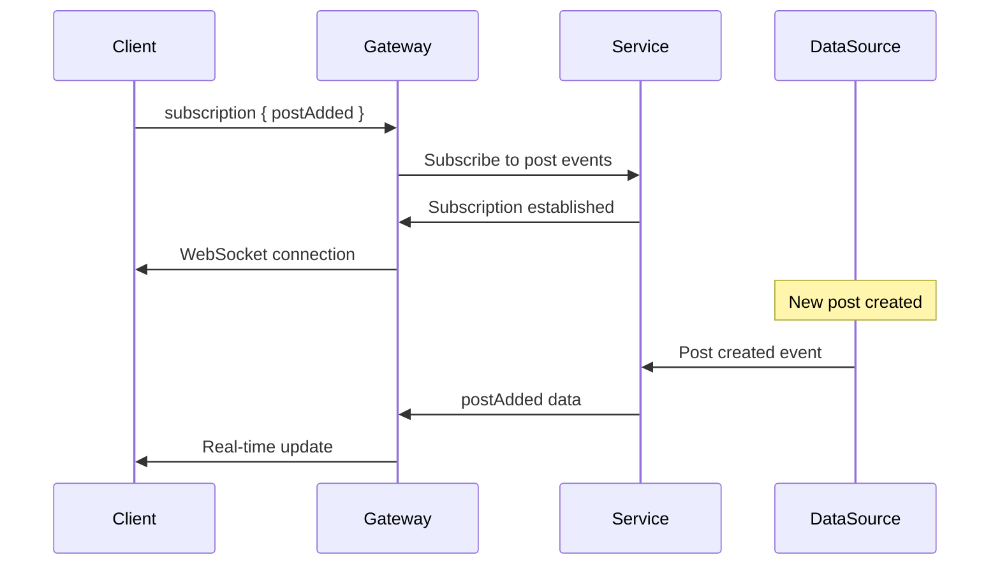
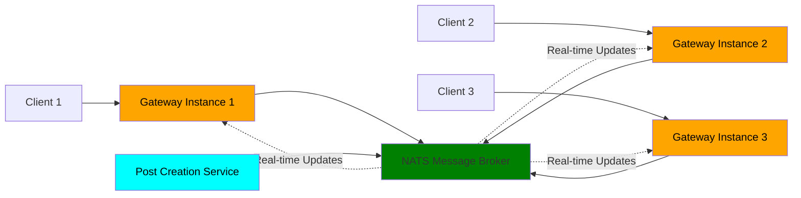

# Unleash the Power of Federation with Hive Gateway v2 🚀

Denis and Arda from The Guild

<PoweredBySlidev />

<!--
- Welcome everyone to this hands-on workshop
- Today we're building a federated GraphQL gateway from scratch
- This is interactive so feel free to code along or just watch and ask questions
-->

---
layout: two-cols-header
---

# About Us & The Guild

The team behind your GraphQL tooling

::left::

## Denis [Placeholder]

- [Role/Background placeholder]
- [Experience placeholder]
- [Fun fact placeholder]

## Arda [Placeholder]

- [Role/Background placeholder]
- [Experience placeholder]
- [Fun fact placeholder]

::right::

## The Guild's Open Source GraphQL Tools

- **GraphQL Yoga** - Production-ready GraphQL server
- **GraphQL Code Generator** - Generate anything from GraphQL schemas
- **GraphQL Mesh** - Query any API with GraphQL
- **GraphQL Hive** - Complete GraphQL platform with gateway, registry & observability

<!--
- Let me start by introducing ourselves and the company behind the tools you probably use
- I'm Denis, this is Arda, we're from The Guild
- We build open-source GraphQL tools that power thousands of applications
- We're passionate about federation, gateways and making GraphQL better for everyone
-->

---

# Also Interesting to See Conference

- [Time] - [Talk Title Placeholder]
- [Time] - [Talk Title Placeholder]
- [Time] - Our Workshop (You are here!)
- [Time] - [Talk Title Placeholder]

<!--
- Before we dive into the workshop, let me mention some other interesting talks happening during the conference
- There are several other sessions that might interest you if you're working with GraphQL
- But for now, let's focus on what we're building together
-->

---
layout: center
---

# Who here has _heard_ about Hive Gateway?

<!--
- Perfect! Now I can see who I'm talking to
-->

---
layout: center
---

# Who here has _worked_ with Hive Gateway?

<!--
- Great! That gives me a good sense of experience levels in the room
- Whether you're new to Hive Gateway or have been using it, today will be valuable
- We're going to build something pretty impressive together
-->

---
layout: two-cols-header
---

# What is Hive Gateway?

Open-source GraphQL federation gateway

::left::

## The Problem

- Multiple GraphQL services
- Need unified API for clients
- Want federation benefits
- Performance and security requirements

## The Solution

High-performance GraphQL gateway that:

- Federates multiple subgraphs
- Handles routing and composition
- Provides production-grade features
- Scales horizontally

::right::

## Why Hive Gateway?

### Built for Production

- Enterprise security features
- Advanced caching and optimization
- Comprehensive observability
- Zero-downtime deployments

### Developer Experience

- TypeScript-first
- Extensive plugin ecosystem
- Great documentation
- Active community support

### Performance

- Request deduplication
- Intelligent caching
- Optimized query planning

<!--
- For those of you who might not be familiar with Hive Gateway yet, let me explain what it is first
- Hive Gateway is a GraphQL router that can act as a GraphQL Federation gateway,
- a subgraph or a proxy gateway for any GraphQL API service,
- solving the federation problem elegantly.
- But, it's not just a gateway, it's a complete production platform,
- built by teams who run GraphQL at scale.
- Oh and, It's free, MIT licensed open source with enterprise features included!
-->

---

# What's Great About Hive Gateway

Production-ready GraphQL federation platform

### Core Strengths

- 🏗️ **Federation Made Easy** - Apollo Federation v2 compatible
- ⚡ **High Performance** - Built for scale with intelligent optimizations
- 🔧 **Developer Friendly** - TypeScript-first with excellent DX
- 🏢 **Enterprise Ready** - Security, monitoring, and reliability built-in
- 🌐 **Any Runtime** - Node.js, Bun, Cloudflare Workers, Docker
- 📦 **Plugin Ecosystem** - Extensible architecture for custom needs

### Why Teams Choose Hive Gateway

- Zero vendor lock-in with open source MIT license
- Battle-tested by companies running GraphQL at scale
- Comprehensive documentation and active community support

<!--
- Let me explain why Hive Gateway is special
- It's not just another GraphQL router - it's a complete federation platform
- Built for real production workloads with enterprise features included
- Works anywhere you can run JavaScript - from traditional servers to edge functions
- The plugin system means you can extend it for your specific needs
- And being MIT licensed means no vendor lock-in concerns
-->

---

# What's New in v2

Built for production workloads from day one

- 🔍 Enhanced OpenTelemetry - Perfect traces with easy setup
- 📊 Dynamic Structured Logging - Change levels without restarts
- 🚀 Event-Driven Subscriptions - Horizontally scalable with NATS
- ⚡ Request Deduplication - Automatic performance optimization

<!--
- Now that you understand what makes Hive Gateway special, let's talk about what's exciting in the recently released version 2
- These features solve real production problems, it's not just a feature showcase
- Let's briefly go over each one:
- Enhanced OpenTelemetry means minimal configuration gets you complete distributed tracing
- Dynamic log level switching without restarts is huge when you're debugging issues at 3am
- Event-driven subscriptions are new in Hive Gateway and let subscriptions scale horizontally
- Request deduplication automatically prevents duplicate network calls by reusing the response from identical subgraph requests
- All of this was built based on feedback from teams running v1 in production
- We'll see every single one of these features in action today
-->

---
layout: intro
---

# Workshop Overview

## What we'll build together

- Federated GraphQL gateway from scratch
- Production-ready features in 90 minutes
- Real-time subscriptions that scale

## You'll learn

- v2's production capabilities
- Advanced security patterns
- How to build bulletproof GraphQL infrastructure

<!--
- Perfect! Now that you know what v2 brings to the table, let me outline what we're going to build
- We're starting with an empty directory and building a production-ready GraphQL federated gateway
- You'll see JWT authentication, distributed subscriptions, dynamic log level switching, and much more
- Everything we build today you can use in production tomorrow!
-->

---
layout: two-cols-header
---

# Our Demo App

Simple Blog Platform

::left::

### Users Service

- User profiles with ID, name, email

### Posts Service

- Blog posts with title and content
- Author relationship via federation
- Role-based access control
- Real-time post notifications

::right::

## Perfect for demonstrating

- GraphQL Yoga for subgraphs
- Hive Gateway for federation
- JWT authentication + authorization directives
- HMAC signature security
- Real-time subscriptions

## User Roles

- 👤 Authenticated user: can see user emails
- 👑 Admin: Can delete any post
- ✍️ Editor: Can create and delete posts

<!--
- For our demo today, we needed to choose a domain that would showcase all these features effectively
- We chose a simple blog platform that everyone understands
- We'll have two services: one for users with profiles and authentication, and one for posts with real-time features
- The users service will demonstrate field-level security with email addresses behind authentication
- The posts service will show off role-based authorization and real-time notifications
- This domain perfectly demonstrates federation, security, and scalability features
-->

---

# Workshop Flow

What We'll Build Together

### Foundation

1. Create Users & Posts subgraphs (GraphQL Yoga)
2. Bootstrap Hive Gateway v2

### Production Features

3. JWT authentication + field-level authorization
4. HMAC signatures for subgraph security
5. Event-Driven Federated Subscriptions
6. Dynamic structured logging (change levels without restarts!)

### Production Polish

7. Security hardening (rate limits, depth limits)
8. Response caching & deduplication
9. OpenTelemetry tracing → Jaeger

<!--
- Alright, let me walk you through exactly how we're going to structure our time together
- The flow will look like this:
- First we get the foundation working with basic federation between our two services
- Then we add the production features which are the meat of this workshop
- Finally we polish the gateway with enterprise-grade features
- The timeline is ambitious but totally achievable!
-->

---
zoom: 0.8
---

# Federation Architecture

How Our Services Connect

<!--
- Now let me give you a visual overview of the complete architecture we're building
- The gateway sits in front of our two GraphQL Yoga subgraphs
- We'll have federation connecting users to posts across service boundaries
- NATS will handle our distributed subscriptions for real-time features
- And Jaeger will collect traces from everything for complete observability
- This diagram shows how all the pieces fit together in production
-->

---
layout: two-cols-header
---

# Multi-Layer Security

JWT + Field-Level Authorization + HMAC

::left::

### Authentication Layer

- JWT token validation
- Support for RS256/HS256 algorithms
- User identity and scopes/scopes extraction

### Authorization Layer

- `@authenticated` directive for basic protection
- `@requiresScopes` directive for role-based access
- Field-level permission control

::right::

## Security Layers

JWT Authentication

- Validates user identity
- Carries user roles/scopes

Authorization Directives

- `@authenticated` - requires any valid user
- `@requiresScopes` - requires specific roles

HMAC Signatures

- Secure subgraph communication
- Protection against tampering

<!--
- Now that we've seen the overall architecture, let's dive into our security implementation
- We'll have three layers of security working together here:
- JWT handles identity and carries role information from the client
- Subgraph directives enforce permissions at the field level
- And HMAC signatures secure the internal communication and ensure only the gateway can communicate with the subgraphs
-->

---
zoom: 0.7
---

# Security Flow

Multi-Layer Security

<!--
- This is how the security flow looks like
- It is quite straightforward:
- JWT validation happens at the gateway level first.
- The directives enforce field-level authorization rules
- The gateway passes user context down to subgraphs
- Each service enforces its own authorization rules but the gateway handles the restrictions
-->

---

# Production-Grade Protection

Security Features

### Rate Limiting 🚦

- Global gateway rate limits
- Per-field rate limiting with `@rateLimit` directive
- Prevent abuse and DoS attacks

### Query Protection 🛡️

- Maximum query depth limits
- Query complexity analysis
- Character count restrictions

<!--
- But there's more!
- Beyond authentication and authorization, we need to protect against abuse
- Which features help with that?
- Rate limiting prevents abuse at multiple levels of your system
- Query protection stops malicious deep nested queries that could overwhelm your servers,
- for example, someone could write a query that goes 50 levels deep and crashes your API.
- These features are essential if you're exposing APIs publicly
-->

---
zoom: 0.7
layout: two-cols-header
---

# Traditional GraphQL Subscriptions

How real-time updates work

::left::

::right::

## Limitations

- Tied to single server instance
- WebSocket connections don't scale horizontally
- Server-Sent Events (SSE) have same scaling issues
- Memory intensive for many concurrent subscriptions

<!--
- Before we dive into EDFS, let's take a step back and explain GraphQL subscriptions for those who might be new to them
- In traditional GraphQL subscriptions, a client opens a subscription typically over WebSocket
- The server maintains the connection and pushes updates when data changes
- This works great for single instances but has serious scaling challenges
- WebSockets are stateful - each connection consumes server memory and creates sticky sessions
- With thousands of users, you're looking at megabytes of memory just for connection overhead
- Server-Sent Events have similar problems plus HTTP connection limits
- You can't easily distribute these connections across multiple server instances
- When your server restarts, all clients have to reconnect at once creating connection storms
-->

---
layout: two-cols-header
---

# EDFS - Subscriptions That Scale

Event-Driven Federated Subscriptions

::left::

### Traditional Subscriptions

- Tied to single gateway instance
- Limited scalability
- Single point of failure

### EDFS with v2

- Distributed across multiple gateways
- Horizontal scaling with NATS
- Fault tolerance built-in
- Built-in adapters included

::right::

## What we'll build

- Real-time post notifications
- NATS message broker integration
- Multi-instance subscription handling
- Fault-tolerant messaging

### Perfect for

Real-time features at enterprise scale 🌐

<!--
- EDFS to the rescue!
- Let me explain why Event-Driven Federated Subscriptions is such a game changer for real-time features
- Traditional subscriptions simply don't scale well beyond a single instance,
- EDFS solves this by using message brokers like NATS or Redis.
- Hive Gateway's pubsub has built-in adapters making setup with either of the message brokers easy
- Perfect for real-time features that need to scale to thousands of users!
-->

---

# EDFS Architecture

Event-Driven Federated Subscriptions

<!--
- EDFS in practice looks something like this
- Here you can see multiple gateway instances all connected via NATS,
- where any service can publish events to the message broker.
- All connected clients get real-time updates regardless of which gateway they're connected to
- This scales horizontally unlike traditional WebSocket or SSE subscriptions
-->

---
layout: two-cols-header
---

# OpenTelemetry Made Simple

Production-Grade Observability

::left::

### What we'll configure

- Gateway tracing with Jaeger integration
- Erm, that's it... Everything else Just Works ™️

::right::

## What you get

- Perfect traces with proper span hierarchy
- Contextual data in every span
- GraphQL context, HTTP details, upstream execution info

<!--
- One thing I love about v2 is how simple observability has become
- The OpenTelemetry setup is incredibly easy now,
- only a few lines of configuration gets you complete distributed tracing.
- Spans are automatically created for all GraphQL operations allowing you
- to see the entire request flow through your federation!
-->

---

# Dynamic Logging Revolution

Change Log Levels Without Restarts 🔄

- Structured logging with request-level metadata
- Request IDs flowing through entire request lifecycle
- Dynamic log level switching during live operation
- Production debugging without downtime

<!--
- Here's another feature that makes production operations so much easier!
- Request IDs make debugging so much easier in distributed systems
- And now, logging got even better, you can switch to debug mode without restarting your production gateway!
- This is absolutely essential for troubleshooting production issues
- I'll demo changing log levels live during our session
-->

---
layout: center
---

# Let's Build! 🛠️

Follow along or just watch - your choice!

We'll start with an empty directory and build:

1. Two federated GraphQL Yoga subgraphs
2. Production-ready gateway
3. Multi-layer security (JWT + HMAC + field-level auth)
4. Real-time subscriptions with EDFS
5. Full observability stack with Jaeger

Let's unleash the power of federation! 🚀

<!--
- Alright, enough talking - it's time to start building this thing!
- Feel free to participate but there's no pressure if you just want to watch
- We're starting completely from scratch with an empty directory
- I'll build everything step by step so you can follow along
- Everyone ready to begin?
-->

---

# Workshop Summary

What we built together today

### Foundation

- Two federated GraphQL Yoga subgraphs
- Hive Gateway v2 setup and configuration

### Production Features

- JWT authentication with field-level authorization
- HMAC signatures for secure subgraph communication
- Event-Driven Federated Subscriptions with NATS
- Dynamic logging with real-time level switching

### Enterprise Polish

- Security hardening (rate limits, query protection)
- Response caching and request deduplication
- Complete observability with OpenTelemetry and Jaeger

### Key Takeaways

- v2 makes production-grade federation accessible
- Security and observability are built-in, not add-ons
- EDFS enables true horizontal scaling for real-time features

<!--
- Before we wrap up, let me recap what we accomplished in just 90 minutes
- We built a complete production-ready federated system
- Every feature we added solves real production challenges
- The key is that v2 makes enterprise features accessible to everyone
- You now have the knowledge to implement this in your own projects
-->

---
layout: center
---

# Visit The Guild Booth! 🏪

Come chat with us about your GraphQL challenges

## What's at our booth

- Live demos of our tools
- GraphQL architecture consultations
- Stickers and swag
- Coffee and conversations

## We'd love to discuss

- Your current GraphQL setup
- Migration strategies
- Performance optimization
- Custom tooling needs

**Booth Location:** [Placeholder - booth number/location]
**Booth Hours:** [Placeholder - hours]

<!--
- I hope this workshop was valuable, but our conversation doesn't have to end here
- We'd love to continue the conversation at our booth
- Bring your real-world GraphQL challenges
- We have demos of all our tools running live
- Great opportunity for one-on-one discussions about your specific needs
- Plus we have great swag and coffee
-->

---

# Resources

Continue Your Journey

### Documentation 📚

- [Hive Gateway Docs](https://the-guild.dev/graphql/hive/docs/gateway)
- [Authentication & Authorization](https://the-guild.dev/graphql/hive/docs/gateway/authorization-authentication)
- [Subscriptions](https://the-guild.dev/graphql/hive/docs/gateway/subscriptions)
- [HMAC Security](https://the-guild.dev/graphql/hive/docs/gateway/other-features/security/hmac-signature)
- [EDFS in Hive Gateway](https://the-guild.dev/graphql/hive/docs/gateway/subscriptions#event-driven-federated-subscriptions-edfs)

### Get Started

- [GitHub Repository](https://github.com/graphql-hive/gateway)

<!--
- For those who want to dive deeper after today's session
- Here are all the documentation links for your follow-up reading
- The GitHub repository has examples and starter templates
- Our community is really active and helpful if you run into issues
- Keep building on what we learned today
-->

---
layout: end
---

# Thank You!

Questions? 🤔

<!--
- Thank you all for participating in this workshop and staying engaged
- Let's open the floor for any questions you might have
- I encourage you to try this out in your own projects
- I'll be available for individual questions after we wrap up
- And don't forget to visit our booth!
-->
