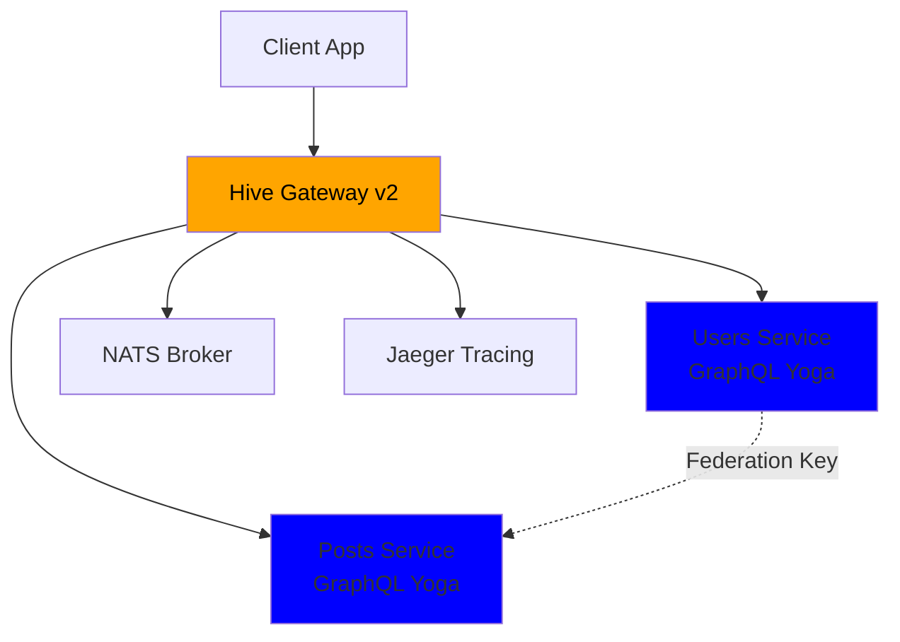
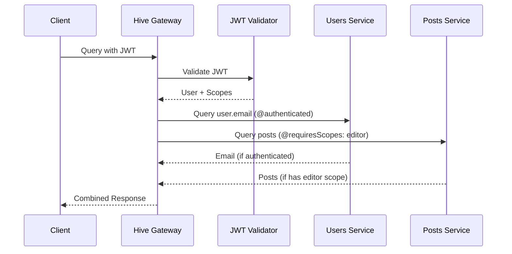
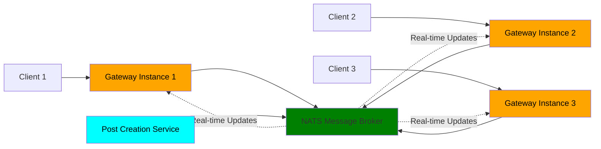

# Unleash the Power of Federation with Hive Gateway v2 🚀

Denis and Arda from The Guild

<!--
- Welcome everyone to this hands-on workshop
- I'm Denis, this is Arda, we're from The Guild
- Today we're building a complete federated GraphQL gateway from scratch
- This is interactive so feel free to code along or just watch and ask questions
- TODO: Intro hive, intro console, route, mention other talks
-->

---
layout: intro
---

# Workshop Overview

## What we'll build together

- Federated GraphQL gateway from scratch
- Production-ready features in 90 minutes
- Real-time subscriptions that scale

## You'll learn

- v2's production capabilities
- Advanced security patterns
- How to build bulletproof GraphQL infrastructure

<!--
- We're starting with an empty directory and building a real production-ready system
- You'll see JWT authentication, distributed subscriptions, dynamic logging, and more
- Everything we build today you can use in production tomorrow
- Who here has worked with Hive Gateway before?
-->

---

# TODO: Hive Gateway

Dont assume anything, explain everything about hive gateway

---
layout: default
---

# What's New in v2

Production-Grade GraphQL Federation

### Key v2 Features

- 🔍 Enhanced OpenTelemetry - Perfect traces with proper setup
- 📊 Dynamic Structured Logging - Change levels without restarts
- 🚀 Event-Driven Subscriptions - Horizontally scalable with NATS
- ⚡ Request Deduplication - Automatic performance optimization
- 💾 Response Caching - Make less requests
- 🛡️ Advanced Security - JWT, HMAC, field-level authorization

_Built for production workloads from day one_

<!--
- These features solve real production problems, it's not just a feature showcase
- Enhanced OpenTelemetry means one config change gets you complete distributed tracing
- Dynamic logging without restarts is huge when you're debugging issues at 3am
- Event-driven subscriptions are new in Hive Gateway and let subscriptions scale horizontally
- Request deduplication automatically prevents duplicate network calls to subgraphs (elaborate?)
- Response caching reduces load on your backend services
- Advanced security gives you enterprise-grade protection out of the box
- All of this was built based on feedback from teams running v1 in production
- We'll see every single one of these features in action today
-->

---
layout: two-cols-header
---

# Our Demo App

Simple Blog Platform

::left::

### Users Service

- User profiles with ID, name, email

### Posts Service

- Blog posts with title and content
- Author relationship via federation
- Role-based access control
- Real-time post notifications

::right::

## Perfect for demonstrating

- GraphQL Yoga for subgraphs
- Hive Gateway for federation
- JWT authentication + authorization directives
- HMAC signature security
- Real-time subscriptions

## User Roles

- 👤 Authenticated user: can see user emails
- 👑 Admin: Can delete any post
- ✍️ Editor: Can create and delete posts

<!--
- We chose a simple domain that everyone understands
- We'll have two services that we'll federate together
- This is perfect for showing auth patterns with intuitive user roles or scopes
- The real-time notifications will showcase our new EDFS feature
-->

---
layout: default
---

# Workshop Flow

What We'll Build Together

### Part 1: Foundation (20 min)

- Create Users & Posts subgraphs (GraphQL Yoga)
- Bootstrap Hive Gateway v2

### Part 2: Production Features (45 min)

- JWT authentication + field-level authorization
- HMAC signatures for subgraph security
- Event-Driven Federated Subscriptions
- Dynamic structured logging (change levels without restarts!)

### Part 3: Production Polish (15 min)

- Security hardening (rate limits, depth limits)
- Response caching & deduplication
- OpenTelemetry tracing → Jaeger

<!--
- The flow will look like this
- First we get the foundation working with basic federation
- Then we add the production features which are the meat of this workshop
- Finally we polish it with enterprise-grade features
- The timeline is ambitious but totally achievable
-->

---
layout: default
zoom: 0.8
---

# Federation Architecture

How Our Services Connect

<!--
- Lets quickly see how the architecture looks
- The gateway sits in front of our two GraphQL Yoga services
- Federation connect users to posts across service boundaries
- NATS handles our distributed subscriptions
- And Jaeger collects traces about everything from the gateway for observability
-->

---
layout: default
zoom: 0.7
---

# Security Flow

Multi-Layer Protection

<!--
- The security flow is quite straight forward
- JWT validation happens at the gateway level first
- Our directives enforce field-level authorization rules
- The gateway passes user context down to subgraphs
- Each service enforces its own authorization rules but the gateway handles the restrictions
-->

---
layout: two-cols-header
---

# Multi-Layer Security

JWT + Field-Level Authorization + HMAC

::left::

### Authentication Layer

- JWT token validation
- Support for RS256/HS256 algorithms
- User identity and scopes/scopes extraction

### Authorization Layer

- `@authenticated` directive for basic protection
- `@requiresScopes` directive for role-based access
- Field-level permission control

::right::

## Security Layers

JWT Authentication

- Validates user identity
- Carries user roles/scopes

Authorization Directives

- `@authenticated` - requires any valid user
- `@requiresScopes` - requires specific roles

HMAC Signatures

- Secure subgraph communication
- Protection against tampering

<!--
Introspection
- Available to everyone for development
-->

<!--
- We'll have three layers of security working together here
- JWT handles identity and carries role information
- Our directives enforce permissions at the field level
- HMAC signatures secure the internal communication and make sure only the gateway can communicate with the subgraps
-->

---
layout: default
---

# Security Features

Production-Grade Protection

### Rate Limiting 🚦

- Global gateway rate limits
- Per-field rate limiting with `@rateLimit` directive
- Prevent abuse and DoS attacks

### Query Protection 🛡️

- Maximum query depth limits
- Query complexity analysis
- Character count restrictions

<!--
- Ok, what about the security features
- Rate limiting prevents abuse at multiple levels of your system
- Query protection stops malicious deep nested queries (_TODO: elaborate_)
- These features are essential if you're exposing APIs publicly
-->

---
layout: default
---

# EDFS Architecture

Event-Driven Federated Subscriptions

<!--
- Now the interesting part, EDFS which stands for event driven federated subscriptions
- Here you can see multiple gateway instances all connected via NATS
- Any service can publish events to the message broker
- All connected clients get real-time updates regardless of which gateway they're connected to
- This scales horizontally unlike traditional WebSocket or SSE subscriptions
-->

---
layout: two-cols-header
---

# EDFS - Subscriptions That Scale

Event-Driven Federated Subscriptions

::left::

### Traditional Subscriptions

- Tied to single gateway instance
- Limited scalability
- Single point of failure

### EDFS with v2

- Distributed across multiple gateways
- Horizontal scaling with NATS
- Fault tolerance built-in
- Built-in adapters included

::right::

## What we'll build

- Real-time post notifications
- NATS message broker integration
- Multi-instance subscription handling
- Fault-tolerant messaging

### Perfect for

Real-time features at enterprise scale 🌐

<!--
- Traditional subscriptions just don't scale well beyond a single instance
- EDFS solves this by using message brokers like NATS or Redis
- The built-in adapters make setup incredibly easy
- This is perfect for real-time features that need to scale to thousands of users
-->

---
layout: two-cols-header
---

# OpenTelemetry Made Simple

Production-Grade Observability

::left::

### What we'll configure

- Gateway tracing with Jaeger integration
- Erm, that's it... Everything else Just Works ™️

::right::

## What you get

- Perfect traces with proper span hierarchy
- Contextual data in every span
- GraphQL context, HTTP details, upstream execution info

<!--
- The OpenTelemetry setup is incredibly simple now
- Literally one configuration change gets you complete distributed tracing
- Spans are automatically created for all GraphQL operations
- You can see the entire request flow through your federation
-->

---

# Dynamic Logging Revolution

Change Log Levels Without Restarts 🔄

- Structured logging with request-level metadata
- Request IDs flowing through entire request lifecycle
- Dynamic log level switching during live operation
- Production debugging without downtime

<!--
- Request IDs make debugging so much easier in distributed systems
- And now, logging got even better, you can switch to debug mode without restarting your production gateway!
- This is absolutely essential for troubleshooting production issues
- I'll demo changing log levels live during our session
-->

---
layout: center
---

# Let's Build! 🛠️

Follow along or just watch - your choice!

We'll start with an empty directory and build:

1. Two federated GraphQL Yoga subgraphs
2. Production-ready gateway
3. Multi-layer security (JWT + HMAC + field-level auth)
4. Real-time subscriptions with EDFS
5. Full observability stack with Jaeger

Let's unleash the power of federation! 🚀

<!--
- Alright, it's time to start coding
- Feel free to participate but there's no pressure if you just want to watch
- We're starting completely from scratch with an empty directory
- I'll build everything step by step so you can follow along
- Everyone ready to begin?
-->

---

# Resources

Continue Your Journey

### Documentation 📚

- [Hive Gateway Docs](https://the-guild.dev/graphql/hive/docs/gateway)
- [Authentication & Authorization](https://the-guild.dev/graphql/hive/docs/gateway/authorization-authentication)
- [Subscriptions](https://the-guild.dev/graphql/hive/docs/gateway/subscriptions)
- [HMAC Security](https://the-guild.dev/graphql/hive/docs/gateway/other-features/security/hmac-signature)
- [EDFS in Hive Gateway](https://the-guild.dev/graphql/hive/docs/gateway/subscriptions#event-driven-federated-subscriptions-edfs)

### Get Started

- [GitHub Repository](https://github.com/graphql-hive/gateway)

<!--
- Here are all the documentation links for your follow-up reading
- The GitHub repository has examples and starter templates
- Our community is really active and helpful if you run into issues
- Keep building on what we learned today
-->

---
layout: end
---

# Thank You!

Questions? 🤔

<!--
- Thank you all for participating in this workshop
- Let's open the floor for any questions you might have
- I encourage you to try this out in your own projects
- I'll be available for individual questions after we wrap up
-->

<!--  -->

- TODO: visualise how subscriptions itself and how they work
- TODO: visualise how subscriptions would look like, like an app. doesnt have to be an app, can be a sketch

- TODO: mention mesh and talk about it (Arda?)
- TODO: mention mesh on how we use in the app

- TODO: summary slide
- TODO: come to the booth slide and shit

- TODO: show the agenda always

- TODO: have people ask questions, but also ask questions ourselves. have a Q/A in each step?
