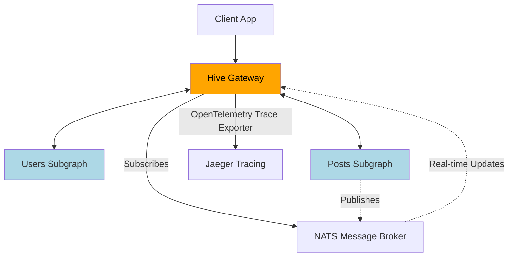
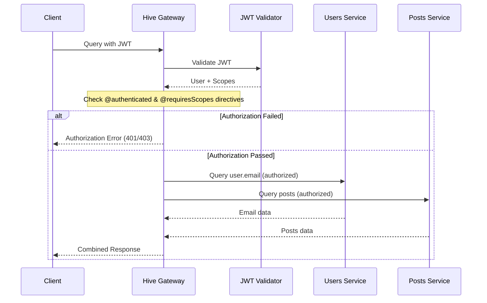
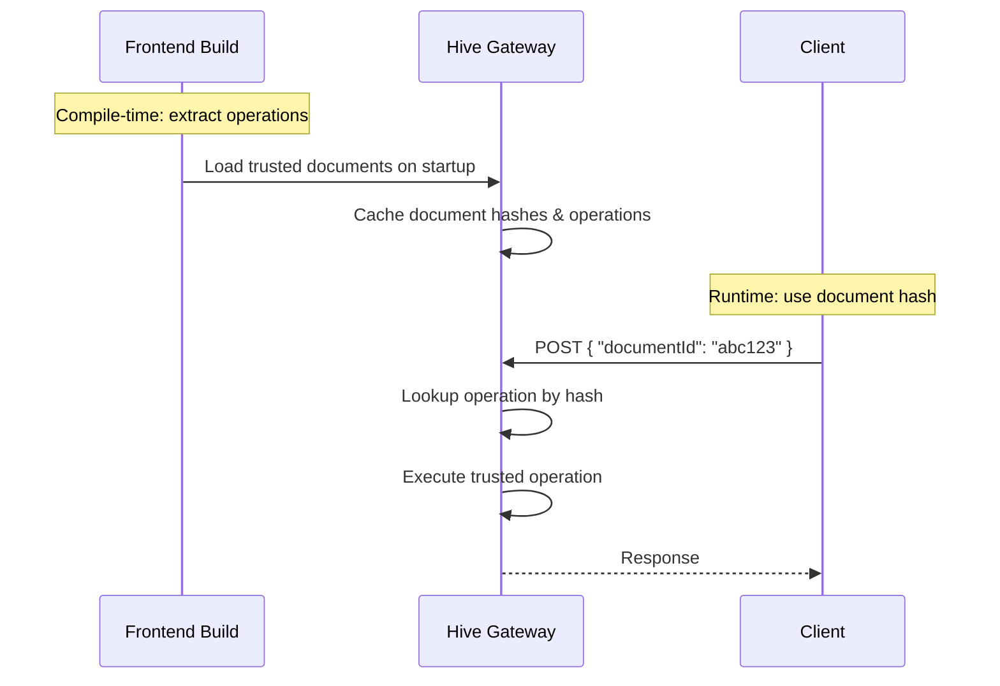
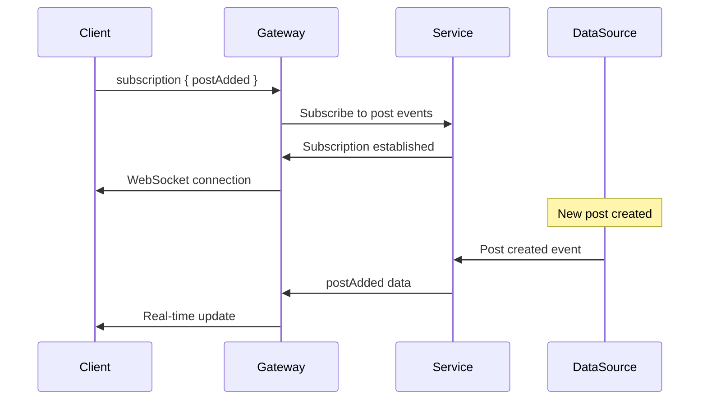
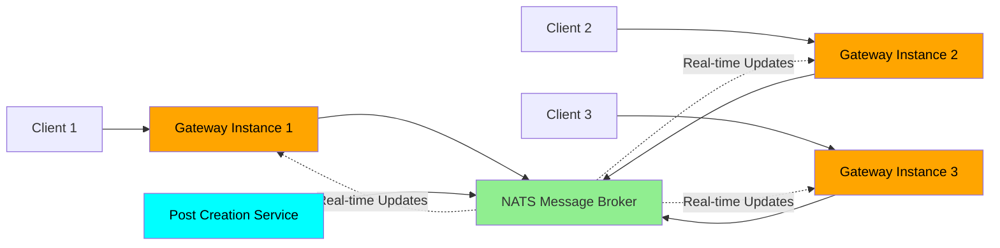

<h1 style="margin-top: 200px; font-size: 3rem">
Unleash the Power of Federation with Hive Gateway
</h1>

Denis and Arda from <b>The Guild</b>

<!--
- Welcome everyone to this workshop
- Today we're building a federated GraphQL system from scratch
- This is interactive so feel free to code along or just watch and ask questions
-->

---
layout: two-cols-header
---

# About Us & The Guild

The team behind your GraphQL tooling

::left::


## Denis

- [`@enisdenjo`](https://github.com/enisdenjo)
- [the-guild.dev](https://the-guild.dev/)
- Software Developer
- 🐛 I create problems

::right::


## Arda

- [`@ardatan`](https://github.com/ardatan)
- [the-guild.dev](https://the-guild.dev/)
- Software Developer
- 🔧 I fix problems

<!--
- Let me start by introducing ourselves and the company behind the tools you probably use
- I'm Denis, this is Arda, we're from The Guild
- We build open-source GraphQL tools that power thousands of applications
- We're passionate about federation, gateways and making GraphQL better for everyone!
-->

---

TODO: **GraphQL Yoga** - Production-ready GraphQL server

TODO: **GraphQL Code Generator** - Generate anything from GraphQL schemas

TODO: **GraphQL Mesh** - Query any API with GraphQL

TODO: **GraphQL Hive** - Complete GraphQL platform with gateway, registry & observability

---
layout: image
image: "./assets/jeff.png"
---

<!--
- Before we dive into the workshop, let me mention Jeff's upcoming talk
- where he'll share what he's learned about schema design: proven design philosophies,
- designing for forward compatibility, exposing errors through types,
- and tips for how to avoid ambiguous or misleading type names.
- But for now, let's focus on what we're building together
-->

---
layout: center
---

# Who here has _heard_ about Hive Gateway?

<!--
- Who here has heard about Hive Gateway? Can I see a raise of hands?
- Perfect! Now I can see who I'm talking to
-->

---
layout: center
---

# Who here has _worked_ with Hive Gateway?

<!--
- Who here has worked with Hive Gateway? Can I see a raise of hands?
- Ok, that gives me a good sense of experience levels in the room
- Whether you're new to Hive Gateway or have been using it, today will be valuable
- We're going to build something pretty impressive together
-->

---
layout: two-cols-header
zoom: 0.9
---

# What is Hive Gateway?

Production-ready GraphQL federation gateway

::left::

## Drop-in Replacement

- **Apollo Router compatible** - Use existing supergraph
- **Zero migration effort** - Seamless integration
- **Full Federation v2** support with Apollo spec compliance

## Cloud-Native Ready

- **Serverless optimized** - AWS Lambda, Cloudflare Workers, GCP, Azure
- **JavaScript native** - No binary dependencies
- **Horizontal scaling** - Built for modern cloud architectures

::right::

## Core Capabilities

### Federation Features

- Query planning and execution across subgraphs
- Automatic schema composition and validation
- Entity resolution and type merging

### Architecture

- MIT licensed open source
- TypeScript-first with full type safety
- Plugin ecosystem for extensibility
- GraphQL Mesh integration

<!--
- For those of you who might not be familiar with Hive Gateway yet, let me explain what it is first
- It's a GraphQL Federation gateway,
- a drop-in replacement for Apollo Router that uses your existing supergraph
- But being JavaScript-native means it runs anywhere JavaScript does - perfect for serverless
- All the features the gateway has to offer are included and open-source
- No licensing restrictions or paywalls, free forever!
-->

---
layout: two-cols-header
zoom: 0.8
---

# What's Great About Hive Gateway

Why teams choose it over alternatives

::left::

### Production Excellence

- 🏢 **Battle-tested at Scale** - Powers applications serving millions of requests daily
- 🚀 **Performance Optimized** - Sub-millisecond query planning with intelligent caching
- 🔄 **Zero-downtime Deployments** - Hot-swap configurations without service interruption
- 📊 **Real-world Benchmarks** - Consistently outperforms alternatives in latency tests

### Developer Experience

- 💡 **Smart Defaults** - Production-ready configuration out of the box
- 🔍 **Debugging Made Easy** - Built-in GraphQL Playground and detailed error messages
- 📦 **Simple Installation** - Standard npm/yarn package with semantic versioning

::right::

### Enterprise Security & Observability

- 🛡️ **Multi-layer Security** - JWT authentication, HMAC signatures, query protection
- 📈 **Comprehensive Metrics** - Request success rates, latency percentiles, error tracking
- 🔍 **OpenTelemetry Integration** - Complete distributed tracing out-of-box
- 📊 **Structured Logging** - Request correlation and dynamic log levels

### Ecosystem & Community

- 🔌 **Rich Plugin System** - Authentication, caching, monitoring, and custom logic
- 🛠️ **Tool Chain Integration** - Works seamlessly with existing GraphQL tooling
- 🌍 **Active Community** - Discord support and regular contributor meetings
- 🌐 **Deploy Anywhere** - From traditional servers to edge functions

<!--
- These are the benefits teams discover after implementing Hive Gateway in production
- The performance gains are measurable - we're talking real improvements between gateways in the JavaScript world
- Smart defaults mean less configuration headaches and faster time to deployment
- The ecosystem support means you're not starting from scratch with plugins and integrations,
- the operational benefits become clear when you're managing this in production
-->

---
layout: two-cols-header
zoom: 0.85
---

# What's New in v2

Built for production workloads from day one

### Enhanced OpenTelemetry & Observability

- 🔍 **Enhanced OpenTelemetry** - Perfect traces with easy setup
- 📊 **Dynamic Structured Logging** - Change levels without restarts
- 🎨 **Refreshed Landing Page** - Cleaner, slimmer gateway startup interface
- ✨ **Updated GraphiQL** - Latest version with Monaco code editor integration

### Event-Driven Architecture & Performance

- 🚀 **Event-Driven Federated Subscriptions** - Horizontally scalable with NATS/Kafka/Redis
- 🔧 **Enhanced PubSub** - Asynchronous calls enabling EDFS functionality
- ⚡ **Inflight Request Deduplication** - Shares results for simultaneous identical subgraph requests
- 📦 **Performance Improvements** - Optimized code structure and dependencies

### Developer Experience & Security

- 🔧 **Enhanced TypeScript** - Stricter type checking and better plugin context propagation
- 🛡️ **Security Hardening** - Multipart disabled by default, integrated protection
- 🔍 **Built-in Query Protection** - Use max tokens, max depth, blocked field suggestions
- 📡 **Modern Node.js Support** - Requires Node.js v20+ (dropped v18 support)

<!--
- Version 2 represents major improvements in both developer experience and production capabilities, some of the ones listed are:
- Enhanced OpenTelemetry means minimal configuration gets you complete distributed tracing
- Dynamic log level switching without restarts is huge when you're debugging issues at 3am
- Event-Driven Federated Subscriptions are new in Hive Gateway and let subscriptions scale horizontally
- Inflight Request deduplication detects when multiple simultaneous requests target the same subgraph with identical parameters
- Instead of making duplicate network calls, the gateway waits for the first request to complete and shares the result with all waiting requests
- The TypeScript improvements provide better type safety and plugin development experience
- Security is now hardened with common GraphQL attack protections built-in
- All of this was built based on feedback from teams running v1 in production
- We'll see some of these features in action today!
-->

---
layout: two-cols-header
zoom: 0.75
---

# Workshop Overview

::left::

## What we'll build

- Complete federated GraphQL system with production features
- Two GraphQL Yoga subgraphs with federation
- Security layers: JWT auth, HMAC signatures, field-level authorization
- Real-time subscriptions with NATS and EDFS
- Full observability with OpenTelemetry and Jaeger

::right::

## You'll learn

### Foundation

- Monorepo setup with Bun workspaces
- GraphQL Yoga subgraphs with Apollo Federation
- Schema composition with GraphQL Mesh
- Hive Gateway v2 configuration

### Security

- JWT authentication with `@authenticated` directives
- HMAC signature validation between gateway and subgraphs
- Role-based authorization with `@requiresScopes`
- Trusted Documents (previusly known as GraphQL Persisted Operations/Documents)
- Attack prevention: depth limits, rate limiting, introspection control

### Real-time & Observability

- Event-driven subscriptions with NATS message broker
- Dynamic log level switching without restarts
- Complete distributed tracing with OpenTelemetry and Jaeger

<!--
- Let's work through building a complete federated system step by step
- We start with basic monorepo setup using Bun and build two federated subgraphs
- Then we compose them with GraphQL Mesh and set up the Hive Gateway
- The security section covers multi-layer protection: JWT for authentication, HMAC for subgraph communication, and field-level authorization with Federation directives
- We'll also implement common GraphQL attack prevention like query depth limits and rate limiting
- And the safest thing you can do for your gateway: trusted documents, aka persisted ops
- The real-time section adds real-time capabilities with NATS-powered subscriptions that scale horizontally
- We finish with production-grade observability using dynamic logging and OpenTelemetry tracing
- Each step will have a git commit so you can follow along or jump to any specific point
- By the end you'll have a complete production-ready federated system
-->

---
layout: two-cols-header
---

# Our Demo App

Simple Blog Platform

::left::

### Users Service

- User profiles with ID, name, email

### Posts Service

- Blog posts with title and content
- Author relationship via federation
- Role-based access control
- Real-time post notifications

::right::

## Perfect for demonstrating

- GraphQL Yoga for subgraphs
- Hive Gateway for federation
- JWT authentication + authorization directives
- HMAC signature security
- Real-time subscriptions

## User Roles

- 👤 Authenticated user: can see user emails
- 👑 Admin: Can delete any post
- ✍️ Editor: Can create and delete posts

<!--
- For our demo today, we needed to choose a domain that would showcase all these features effectively:
- A simple blog platform that everyone understands
- We'll have two services: users and posts
- The users service will demonstrate field-level security by placing email addresses behind authentication,
- while the posts service will show off role-based authorization and real-time notifications.
- This domain will serve us great to demonstrate federation, security, and the scalability features
-->

---
zoom: 0.8
---

# Federation Architecture

How Our Services Connect



<!--
- This is a visual overview of the complete architecture we're building
- The gateway sits in front of our two GraphQL Yoga subgraphs
- We'll use GraphQL Mesh to compose our supergraph from the individual schemas
- Federation connects users to posts across service boundaries
- NATS will handle our distributed subscriptions for real-time features
- And Jaeger will collect traces from everything for complete observability
-->

---
layout: two-cols-header
---

# Multi-Layer Security

JWT + Field-Level Authorization + HMAC

::left::

### Authentication Layer

- JWT token validation
- Support for RS256/HS256 algorithms
- User identity and scopes/scopes extraction

### Authorization Layer

- `@authenticated` directive for basic protection
- `@requiresScopes` directive for role-based access
- Field-level permission control

::right::

## Security Layers

JWT Authentication

- Validates user identity
- Carries user roles/scopes

Authorization Directives

- `@authenticated` - requires any valid user
- `@requiresScopes` - requires specific roles

HMAC Signatures

- Secure subgraph communication
- Protection against tampering

<!--
- Now that we've seen the overall architecture, let's dive into security.
- We'll have three layers of security working together here:
- JWT handles authentication, identity and carries role information from the client
- Subgraph directives enforce permissions at the field level
- And finally HMAC signatures secure the internal communication and ensure only the gateway can communicate with the subgraphs
-->

---
zoom: 1
---

# Security Flow & Protection

Multi-Layer Security with Federation Directives

<div class="grid grid-cols-[60%_40%] gap-4">
<div>



</div>
<div>

### Built-in Protection Features

- **Rate Limiting** - Global gateway limits + per-field `@rateLimit` directive
- **Query Depth Limits** - Prevent deep nested attacks that overwhelm servers
- **Token Count Limits** - Block queries with excessive field aliases
- **Field Suggestion Blocking** - Prevent schema discovery via error messages
- **Introspection Control** - Disable schema introspection in production

</div>
</div>

<!--
- This diagram shows our complete security architecture with federation directive-based authorization
- The gateway validates JWT first to extract user identity and scopes
- Then it checks all authentication directives in the query plan
- If any field requires authentication or scopes the user doesn't have, the gateway immediately returns an authorization error
- The subgraphs never receive unauthorized requests - this protects your backend services from unnecessary load
- Only when all authorization checks pass does the gateway make requests to the subgraphs
- Beyond authorization, we protect against common GraphQL attacks
- Rate limiting prevents abuse at multiple levels,
- query protection stops malicious deep nested queries,
- field suggestion blocking prevents schema discovery attacks even when introspection is disabled
-->

---
layout: two-cols-header
zoom: 0.7
---

# Trusted Documents

Maximum Security with GraphQL Persisted Operations

::left::

### What are Trusted Documents?

- **Pre-approved Operations** - Only allow execution of pre-registered GraphQL queries
- **Document Hash Mapping** - Client sends hash instead of full query string
- **Zero Runtime Parsing** - Gateway validates hash and executes cached operation
- **Complete Query Control** - Block all ad-hoc queries from reaching your API

### Security Benefits

- **Prevents Query Injection** - Malicious queries cannot be executed
- **Schema Privacy** - No query introspection or discovery possible
- **Resource Protection** - Only vetted, optimized queries run in production
- **Compliance Ready** - Perfect for regulated industries requiring strict API control

### Production Benefits

- **Performance Boost** - Skip query parsing and validation
- **Bandwidth Savings** - Send tiny hashes instead of large queries
- **Attack Surface Reduction** - Eliminate entire classes of GraphQL attacks
- **Monitoring Clarity** - Track specific operations instead of dynamic queries

::right::



<!--
- Trusted Documents represent the ultimate security layer for GraphQL APIs
- Instead of accepting arbitrary queries, you pre-register all allowed operations at build time
- Clients send a document hash instead of the full query, which the gateway looks up and executes
- This eliminates query injection attacks, schema discovery, and gives you complete control over what can run
- The performance benefits are substantial too - no parsing or validation overhead in production
- We'll implement this as part of our security hardening to show how easy it is to set up
-->

---
zoom: 0.7
---

# Traditional GraphQL Subscriptions

How real-time updates work

<div class="grid grid-cols-[60%_40%] gap-4">
<div>



</div>
<div>

## Scaling Challenges

### WebSocket Limitations

- **Stateful connections** - Each client holds open connection consuming server memory
- **Sticky sessions** - Clients must reconnect to same server instance
- **Vertical scaling only** - Can't distribute connections across instances
- **Connection storms** - Mass reconnections during server restarts

### Server-Sent Events (SSE) Issues

- **Same memory problems** - Each connection consumes server resources
- **HTTP/1.1 connection limits** - Browsers limit concurrent connections per domain
- **No bidirectional communication** - Server can only push, not receive
- **Connection management complexity** - Handling disconnects and reconnects

</div>
</div>

<!--
- Let's talk subscriptions now
- I'll explain GraphQL subscriptions for those who might be new to them
- In traditional GraphQL subscriptions, a client opens a subscription typically over a WebSocket connection
- The server maintains the connection and pushes updates when data changes
- This works great on paper but has serious scaling challenges
- WebSockets are stateful - each connection consumes server memory and creates sticky sessions
- With thousands of users, you're looking at megabytes of memory just for connection overhead
- Server-Sent Events have similar problems when dealing with HTTP/1
- You can't easily distribute these connections across multiple server instances
- In federated structures, gateways connect to subgraphs for subscriptions, putting pressure on both gateways and subgraphs
- This creates bottlenecks because subgraphs become single points of failure for subscription data
- You can't easily have multiple distributed gateways because each needs its own connection to subgraphs
- When your server restarts, all clients have to reconnect at once creating connection storms
-->

---
layout: two-cols-header
---

# EDFS - Subscriptions That Scale

Event-Driven Federated Subscriptions

::left::

### Traditional Subscriptions

- Tied to single gateway instance
- Limited scalability
- Single point of failure

### EDFS with v2

- Distributed across multiple gateways
- Horizontal scaling with NATS
- Fault tolerance built-in
- Built-in adapters included

::right::

## What we'll build

- Real-time post notifications
- NATS message broker integration
- Multi-instance subscription handling
- Fault-tolerant messaging

### Perfect for

Real-time features at enterprise scale 🌐

<!--
- EDFS to the rescue!
- Also known as Event-Driven Federated Subscriptions
- It solves all of the traditional issues we talked about by using message brokers like NATS, Kafka, or Redis
- Starting v2, Hive Gateway's pubsub has built-in adapters making setup with any of these message brokers easy
- Perfect for real-time features that need to scale to thousands of users!
- Here's a cool feature: with EDFS, you can emit only the keys of a GraphQL type and the gateway will resolve the rest of the fields
- For example, our Post type has an "id" key - you can publish a message to NATS containing only the "id" field, but request more fields in the GraphQL subscription query
- The gateway will intelligently resolve any other fields provided in the GraphQL subscription query, fetching data from the appropriate subgraphs as needed
-->

---

# EDFS Architecture

Event-Driven Federated Subscriptions



<!--
- In practice it looks something like this
- Here you can see multiple gateway instances all connected via NATS
- where any service can publish events to the message broker
- They dont even have to be subgraphs!
- All connected clients get real-time updates regardless of which gateway they're connected to
- This scales horizontally unlike traditional WebSocket or SSE subscriptions to subgraphs
- The beauty of EDFS is that it decouples the subscription source from the subscription consumers
- Services can publish events to NATS without knowing which gateways or clients are listening
- Gateways can scale independently because they're not holding stateful connections to subgraphs
- If one gateway goes down, clients can reconnect to another gateway and still receive all the same real-time updates
- Same goes for the subgraphs, they can go down without disturbing the gateway or the clients
- The message broker handles the distribution, making the whole system fault-tolerant and highly available
-->

---

# Hive Logger

Modern logging for GraphQL applications

### Key Features

- 🏷️ **Structured Logging** - JSON output with consistent metadata
- 🔗 **Request Correlation** - Automatic request ID propagation
- 📊 **Context Inheritance** - Child loggers inherit parent metadata
- 🔄 **Dynamic Log Levels** - Change verbosity without restarts
- 🔌 **Pluggable Writers** - Pino, Winston, or custom integrations

### Perfect for Production

- Filter logs by request ID to trace entire request lifecycle
- Structured data makes log aggregation and searching easier
- Performance optimized with lazy evaluation
- Cross-platform compatibility (Node.js, Bun, edge runtimes)

<!--
- Before we talk about logging, let me introduce Hive Logger
- It's our modern logging solution designed to run everywhere JavaScript does,
- No more lock-in to Node or any other platform.
- Built for performance with lazy evaluation of log messages,
- The key improvement the logger carries to Hive Gateway version 2, is that
- every log entry automatically gets tagged with the request ID.
- This means you can filter your logs by a specific request and see its entire journey
- Oh and, you can cusotomize the underlying writer
- plug in your favorite logging library like Pino or Winston,
- Or output JSON? Or you can simply write to a file - it's up to you.
-->

---

# Dynamic Logging Revolution

Change Log Levels Without Restarts 🔄

- Structured logging with request-level metadata
- Request IDs flowing through entire request lifecycle
- Dynamic log level switching during live operation
- Production debugging without downtime

<!--
- Now let's see Hive Logger in action with its most interesting feature for Hive Gateway
- You can switch to debug mode without restarting your production gateway!
- This is absolutely essential for troubleshooting production issues
- Imagine it's 3am, something's wrong in production, and you need more verbose logging
- Instead of restarting services and potentially making things worse, you just change the log level
- I'll demo changing log levels live during our session
-->

---

# OpenTelemetry Made Simple

Production-Grade Observability

### What we'll configure

- Set up with the official OpenTelemetry SDK
- Configure tracing and Jaeger integration
- Erm, that's it... Everything else Just Works ™️

## What you get

- Perfect traces with proper span hierarchy
- Contextual data in every span
- GraphQL context, HTTP details, upstream execution info

<!--
- One thing I love about v2 is how simple observability has become
- The OpenTelemetry setup is incredibly easy now,
- only a few lines of configuration gets you complete distributed tracing.
- Basically, you just have to configure OpenTelemetry itself,
- Hive Gateway will pick up the rest.
- Spans are automatically created for all GraphQL operations allowing you
- to see the entire request flow through your federation!
-->

---
zoom: 0.9
---

# Let's Build! 🛠️

Three ways to participate - your choice!

**Repository:** [graphql-hive/graphql-conf-2025-gateway-workshop](https://github.com/graphql-hive/graphql-conf-2025-gateway-workshop)

### Code Together

Prerequisites: [Bun](https://bun.sh) + [Docker](https://docker.com)

Join us in build from scratch!

### Follow Along

Clone and pull latest changes:

```sh
git clone git@github.com:graphql-hive/graphql-conf-2025-gateway-workshop.git
git pull # as we progress
```

### Join Whenever

If suddenly you have the urge to join, just clone the repo and read its README.md.

Let's unleash the power of federation! 🚀

<!--
- Alright, enough talking - it's time to start building this thing!
- Three different ways to participate based on your preference
- We're starting completely from scratch with an empty directory
- I'll build everything step by step and commit as we go
- Everyone ready to begin?
-->

---
layout: two-cols-header
zoom: 0.9
---

# Workshop Summary

What we built together today

::left::

### Foundation

- Two federated GraphQL Yoga subgraphs
- Hive Gateway v2 setup and configuration

### Production Features

- JWT authentication with field-level authorization
- HMAC signatures for secure subgraph communication
- Event-Driven Federated Subscriptions with NATS
- Dynamic logging with real-time level switching

### Enterprise Polish

- Security hardening (rate limits, query protection)
- Response caching and request deduplication
- Complete observability with OpenTelemetry and Jaeger

::right::

### Key Takeaways

- v2 makes production-grade federation accessible
- Security and observability are built-in, not add-ons
- EDFS enables true horizontal scaling for real-time features

<!--
- Before we wrap up, let me recap what we just accomplished
- We built a complete production-ready federated system
- Every feature we added solves real production challenges
- The key is that v2 makes enterprise features accessible to everyone
- You now have the knowledge to implement this in your own projects
-->

---
layout: center
---

# Visit The Guild Booth!

Come chat with us about your GraphQL challenges

## What's at our booth

- Live demos of our tools
- GraphQL architecture consultations
- Stickers and swag
- Coffee and conversations

## We'd love to discuss

- Your current GraphQL setup
- Migration strategies
- Performance optimization
- Custom tooling needs

<!--
- I hope this workshop was valuable, but our conversation doesn't have to end here
- We'd love to continue the conversation at our booth
- Bring your real-world GraphQL challenges
- We have demos of all our tools running live
- Great opportunity for one-on-one discussions about your specific needs
- Plus we have great swag and coffee
-->

---
layout: two-cols-header
zoom: 0.95
---

# Resources

Continue Your Journey

<div class="grid grid-cols-[70%_30%] gap-4">
<div>

### Workshop Materials 📚

- **[Workshop Repository](https://github.com/graphql-hive/graphql-conf-2025-gateway-workshop)** - Complete code and step-by-step commits
- **[This Workshop](https://graphql.org/conf/2025/schedule/6fbc71a3ad13189339d753cb078ec781/)** - GraphQL Conf 2025 session

### Documentation & Guides

- [Hive Gateway Docs](https://the-guild.dev/graphql/hive/docs/gateway)
- [Authentication & Authorization](https://the-guild.dev/graphql/hive/docs/gateway/authorization-authentication)
- [EDFS Guide](https://wundergraph.com/blog/distributed_graphql_subscriptions_with_nats_and_event_driven_architecture)
- [GraphQL Mesh Compose](https://the-guild.dev/graphql/mesh)
- [GraphQL Yoga](https://the-guild.dev/graphql/yoga-server)

### Tools & Platforms

- [Hive Console](https://the-guild.dev/graphql/hive) - Complete GraphQL platform
- [Self-hosting Hive](https://the-guild.dev/graphql/hive/docs/self-hosting/get-started)
- [The Guild](https://the-guild.dev) - Open source GraphQL tools

</div>
<div>

<QRCode
  :width="300"
  :height="300"
  type="svg"
  data="https://github.com/graphql-hive/graphql-conf-2025-gateway-workshop"
  :dotsOptions="{ color: '#121212' }"
  :backgroundOptions="{ color: 'white' }"
/>

</div>
</div>

<!--
- For those who want to dive deeper after today's session
- Here are all the documentation links for your follow-up reading
- The GitHub repository has examples and starter templates
- Our community is really active and helpful if you run into issues
- Keep building on what we learned today
-->

---
layout: end
---

# Thank You!

Questions? 🤔

<!--
- Thank you all for participating in this workshop and staying engaged
- Let's open the floor for any questions you might have
- I encourage you to try this out in your own projects
- I'll be available for individual questions after we wrap up
- And don't forget to visit our booth!
-->
