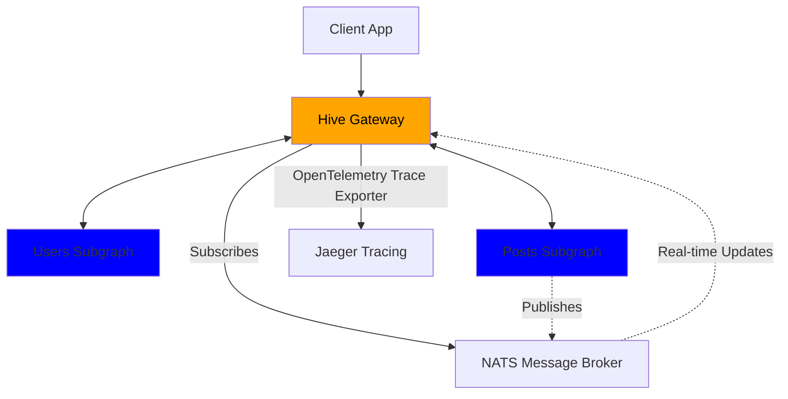
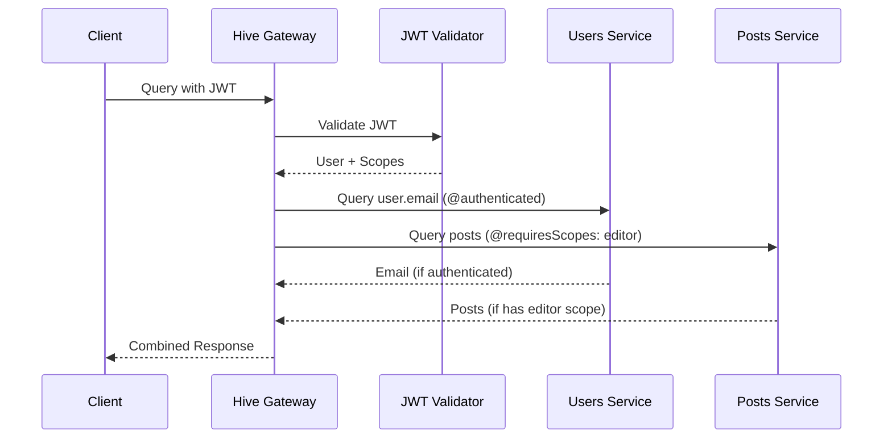
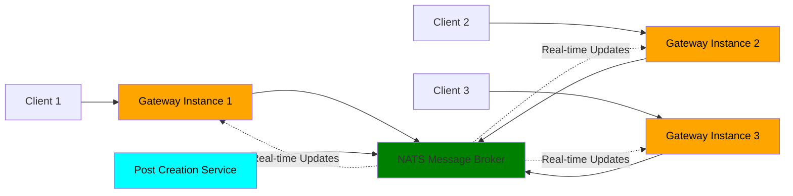

# Unleash the Power of Federation with Hive Gateway v2 🚀

Denis and Arda from The Guild

<PoweredBySlidev />

<!--
- Welcome everyone to this hands-on workshop
- Today we're building a federated GraphQL gateway from scratch
- This is interactive so feel free to code along or just watch and ask questions
-->

---
layout: two-cols-header
---

# About Us & The Guild

The team behind your GraphQL tooling

::left::

## Denis [Placeholder]

- [Role/Background placeholder]
- [Experience placeholder]
- [Fun fact placeholder]

## Arda [Placeholder]

- [Role/Background placeholder]
- [Experience placeholder]
- [Fun fact placeholder]

::right::

## The Guild's Open Source GraphQL Tools

- **GraphQL Yoga** - Production-ready GraphQL server
- **GraphQL Code Generator** - Generate anything from GraphQL schemas
- **GraphQL Mesh** - Query any API with GraphQL
- **GraphQL Hive** - Complete GraphQL platform with gateway, registry & observability

<!--
- Let me start by introducing ourselves and the company behind the tools you probably use
- I'm Denis, this is Arda, we're from The Guild
- We build open-source GraphQL tools that power thousands of applications
- We're passionate about federation, gateways and making GraphQL better for everyone
-->

---

# Also Interesting to See Conference

- [Time] - [Talk Title Placeholder]
- [Time] - [Talk Title Placeholder]
- [Time] - Our Workshop (You are here!)
- [Time] - [Talk Title Placeholder]

<!--
- Before we dive into the workshop, let me mention some other interesting talks happening during the conference
- There are several other sessions that might interest you if you're working with GraphQL
- But for now, let's focus on what we're building together
-->

---
layout: center
---

# Who here has _heard_ about Hive Gateway?

<!--
- Perfect! Now I can see who I'm talking to
-->

---
layout: center
---

# Who here has _worked_ with Hive Gateway?

<!--
- Great! That gives me a good sense of experience levels in the room
- Whether you're new to Hive Gateway or have been using it, today will be valuable
- We're going to build something pretty impressive together
-->

---
layout: two-cols-header
---

# What is Hive Gateway?

Open-source GraphQL federation gateway

::left::

## The Problem

- Multiple GraphQL services scattered across teams
- Each has its own API endpoint and schema
- Clients need to know about all services
- No unified security or monitoring

## The Solution

A unified GraphQL layer that:

- Combines multiple schemas into one
- Routes queries to appropriate services
- Handles federation complexity automatically
- Provides single endpoint for clients

::right::

## How It Works

### Federation Router

- Composes supergraph from subgraph schemas
- Plans query execution across services
- Merges responses transparently

### Proxy Gateway

- Can proxy any existing GraphQL API
- No schema changes required
- Add security and monitoring instantly

### Subgraph Support

- Can act as a federated subgraph itself
- Integrates with existing federation

<!--
- For those of you who might not be familiar with Hive Gateway yet, let me explain what it is first
- Think of it as solving the "microservices for GraphQL" problem
- Instead of clients calling multiple GraphQL APIs, they call one gateway
- The gateway handles all the complexity of routing, federation, and composition
- It can work as a federation router, a simple proxy, or even as a subgraph itself
- This eliminates the client-side complexity of managing multiple endpoints
-->

---

# What's Great About Hive Gateway

Why teams choose it over alternatives

### Production-First Design

- 🛡️ **Enterprise Security** - JWT, HMAC, rate limiting, query depth protection
- 📈 **Built to Scale** - Horizontal scaling, load balancing, zero-downtime deployments
- 🔍 **Complete Observability** - OpenTelemetry, structured logging, performance metrics
- ⚡ **Intelligent Optimizations** - Request deduplication, response caching, query planning

### Developer Experience

- 🔧 **TypeScript-First** - Full type safety and excellent IDE support
- 📦 **Extensible** - Rich plugin ecosystem for custom requirements
- 🌐 **Runtime Agnostic** - Node.js, Bun, Cloudflare Workers, Docker
- 📚 **Well Documented** - Comprehensive guides and active community

### Zero Vendor Lock-in

- MIT licensed open source - use anywhere, modify freely
- No proprietary extensions or cloud dependencies
- Battle-tested by companies at scale

<!--
- Now let me explain why Hive Gateway stands out from other GraphQL gateway solutions
- It's designed with production workloads in mind from day one
- Security isn't an afterthought - it's built into every layer
- The observability features help you understand what's happening in production
- TypeScript support means fewer runtime errors and better developer productivity
- And being MIT licensed means you're never locked into a vendor
- You can run it anywhere JavaScript runs - from traditional servers to edge functions
-->

---

# What's New in v2

Built for production workloads from day one

- 🔍 Enhanced OpenTelemetry - Perfect traces with easy setup
- 📊 Dynamic Structured Logging - Change levels without restarts
- 🚀 Event-Driven Subscriptions - Horizontally scalable with NATS
- ⚡ Request Deduplication - Automatic performance optimization

<!--
- Now that you understand what makes Hive Gateway special, let's talk about what's exciting in the recently released version 2
- These features solve real production problems, it's not just a feature showcase
- Let's briefly go over each one:
- Enhanced OpenTelemetry means minimal configuration gets you complete distributed tracing
- Dynamic log level switching without restarts is huge when you're debugging issues at 3am
- Event-driven subscriptions are new in Hive Gateway and let subscriptions scale horizontally
- Request deduplication automatically prevents duplicate network calls by reusing the response from identical subgraph requests
- All of this was built based on feedback from teams running v1 in production
- We'll see every single one of these features in action today
-->

---
layout: intro
---

# Workshop Overview

## What we'll build together

- Federated GraphQL gateway from scratch
- Production-ready features in 90 minutes
- Real-time subscriptions that scale

## You'll learn

- v2's production capabilities
- Advanced security patterns
- How to build bulletproof GraphQL infrastructure

<!--
- Perfect! Let me outline what we're going to build
- We're starting with an empty directory and building a production-ready GraphQL federated gateway
- You'll see JWT authentication, distributed subscriptions, dynamic log level switching, and much more
- Everything we build today you can use in production tomorrow!
-->

---
layout: two-cols-header
---

# Our Demo App

Simple Blog Platform

::left::

### Users Service

- User profiles with ID, name, email

### Posts Service

- Blog posts with title and content
- Author relationship via federation
- Role-based access control
- Real-time post notifications

::right::

## Perfect for demonstrating

- GraphQL Yoga for subgraphs
- Hive Gateway for federation
- JWT authentication + authorization directives
- HMAC signature security
- Real-time subscriptions

## User Roles

- 👤 Authenticated user: can see user emails
- 👑 Admin: Can delete any post
- ✍️ Editor: Can create and delete posts

<!--
- For our demo today, we needed to choose a domain that would showcase all these features effectively:
- A simple blog platform that everyone understands
- We'll have two services: one for users with profiles and authentication, and one for posts with real-time features
- The users service will demonstrate field-level security by placing email addresses behind authentication,
- while the posts service will show off role-based authorization and real-time notifications.
- This domain perfectly demonstrates federation, security, and scalability features
-->

---

# Workshop Flow

What We'll Build Together

### Foundation

1. **Setup Monorepo** - Bun init, workspaces, Prettier
2. **Create Subgraphs** - Users & Posts with GraphQL Yoga
3. **Compose Supergraph** - Using GraphQL Mesh
4. **Bootstrap Gateway** - Hive Gateway v2 with auto-reload

### Production

5. **JWT Authentication** - Token validation + field-level auth
6. **HMAC Security** - Secure subgraph communication
7. **Authorization Directives** - `@authenticated` & `@requiresScopes`
8. **Security Hardening** - Depth limits, rate limiting, introspection control
9. **EDFS with NATS** - Scalable real-time subscriptions

### Observability

10. **Dynamic Logging** - Runtime log level switching
11. **OpenTelemetry** - Distributed tracing with Jaeger

<!--
- The flow will look like this and I'll commit after each major step so you can follow along:
- First we set up a proper monorepo structure with Bun and workspaces
- Then we create our GraphQL Yoga subgraphs and use GraphQL Mesh to compose the supergraph
- We'll bootstrap Hive Gateway with auto-reload for a smooth development experience
- Then we layer on JWT authentication with proper field-level authorization directives
- We'll secure subgraph communication with HMAC signatures
- Add comprehensive security hardening against common GraphQL attacks
- Build scalable real-time subscriptions with EDFS and NATS
- Finally we'll add dynamic logging and complete observability with OpenTelemetry
- Each step builds on the previous one and you can git checkout any step to follow along
-->

---
zoom: 0.8
---

# Federation Architecture

How Our Services Connect

<!--
- Let me give you a visual overview of the complete architecture we're building
- The gateway sits in front of our two GraphQL Yoga subgraphs
- We'll use GraphQL Mesh to compose our supergraph from the individual schemas
- Federation connects users to posts across service boundaries
- NATS will handle our distributed subscriptions for real-time features
- And Jaeger will collect traces from everything for complete observability
- This diagram shows how all the pieces fit together in our production setup
-->

---
layout: two-cols-header
---

# Multi-Layer Security

JWT + Field-Level Authorization + HMAC

::left::

### Authentication Layer

- JWT token validation
- Support for RS256/HS256 algorithms
- User identity and scopes/scopes extraction

### Authorization Layer

- `@authenticated` directive for basic protection
- `@requiresScopes` directive for role-based access
- Field-level permission control

::right::

## Security Layers

JWT Authentication

- Validates user identity
- Carries user roles/scopes

Authorization Directives

- `@authenticated` - requires any valid user
- `@requiresScopes` - requires specific roles

HMAC Signatures

- Secure subgraph communication
- Protection against tampering

<!--
- Now that we've seen the overall architecture, let's dive into security.
- We'll have three layers of security working together here:
- JWT handles authentication, identity and carries role information from the client
- Subgraph directives enforce permissions at the field level
- And HMAC signatures secure the internal communication and ensure only the gateway can communicate with the subgraphs
-->

---
zoom: 0.7
---

# Security Flow

Multi-Layer Security

<!--
- This is how the security flow works in our implementation
- JWT validation happens at the gateway level first
- The directives enforce field-level authorization rules
- We'll show two approaches: forwarding JWT payload directly to subgraphs, and extracting user ID to propagate as headers
- Each service enforces its own authorization rules but the gateway handles the restrictions
- Important note: if the JWT doesn't have the necessary permissions defined by the directives, the request won't even reach the users or posts services - the gateway blocks it early
- We'll demonstrate this with both authenticated fields and scope-based mutations
-->

---

# Production-Grade Protection

Security Features

### Rate Limiting 🚦

- Global gateway rate limits
- Per-field rate limiting with `@rateLimit` directive
- Prevent abuse and DoS attacks

### Query Protection 🛡️

- Maximum query depth limits
- Character count restrictions
- _And much more..._

<!--
- But there's more security beyond authentication and authorization!
- Beyond authentication and authorization, we need to protect against abuse
- Rate limiting prevents abuse at multiple levels of your system
- The `@rateLimit` directive lets you protect specific heavy fields - for example, you could rate limit an expensive search operation while allowing normal queries to flow freely
- Query protection stops malicious deep nested queries that could overwhelm your servers
- For example, someone could write a query that goes 50 levels deep and crashes your API
- We have many more query protection features available like complexity analysis and alias limits, but we'll showcase these two to get you started with secure defaults
- These features are essential if you're exposing APIs publicly
-->

---
zoom: 0.7
layout: two-cols-header
---

# Traditional GraphQL Subscriptions

How real-time updates work

::left::

::right::

## Scaling Challenges

### WebSocket Limitations

- **Stateful connections** - Each client holds open connection consuming server memory
- **Sticky sessions** - Clients must reconnect to same server instance
- **Vertical scaling only** - Can't distribute connections across instances
- **Connection storms** - Mass reconnections during server restarts

### Server-Sent Events (SSE) Issues

- **Same memory problems** - Each connection consumes server resources
- **HTTP/1.1 connection limits** - Browsers limit concurrent connections per domain
- **No bidirectional communication** - Server can only push, not receive
- **Connection management complexity** - Handling disconnects and reconnects

### Resource Consumption

- **Memory per connection** - 2-8KB per WebSocket, multiplied by thousands of users
- **Event loop blocking** - Too many connections can overwhelm Node.js event loop
- **Network overhead** - Keeping connections alive requires constant heartbeats

<!--
- Let's talk subscriptions now
- I mentioned EDFS, but first let us take a step back and explain GraphQL subscriptions for those who might be new to them
- In traditional GraphQL subscriptions, a client opens a subscription typically over a WebSocket connection
- The server maintains the connection and pushes updates when data changes
- This works great for single instances but has serious scaling challenges
- WebSockets are stateful - each connection consumes server memory and creates sticky sessions
- With thousands of users, you're looking at megabytes of memory just for connection overhead
- Server-Sent Events have similar problems plus HTTP connection limits
- You can't easily distribute these connections across multiple server instances
- In federated structures, gateways connect to subgraphs for subscriptions, putting pressure on both gateways and subgraphs
- This creates bottlenecks because subgraphs become single points of failure for subscription data
- You can't easily have multiple distributed gateways because each needs its own connection to subgraphs
- When your server restarts, all clients have to reconnect at once creating connection storms
-->

---
layout: two-cols-header
---

# EDFS - Subscriptions That Scale

Event-Driven Federated Subscriptions

::left::

### Traditional Subscriptions

- Tied to single gateway instance
- Limited scalability
- Single point of failure

### EDFS with v2

- Distributed across multiple gateways
- Horizontal scaling with NATS
- Fault tolerance built-in
- Built-in adapters included

::right::

## What we'll build

- Real-time post notifications
- NATS message broker integration
- Multi-instance subscription handling
- Fault-tolerant messaging

### Perfect for

Real-time features at enterprise scale 🌐

<!--
- EDFS to the rescue!
- Why are Event-Driven Federated Subscriptions such a game changer for real-time features?
- Well, traditional subscriptions simply don't scale well beyond a single instance
- EDFS solves this by using message brokers like NATS, Kafka, or Redis
- Starting v2, Hive Gateway's pubsub has built-in adapters making setup with any of these message brokers easy
- Perfect for real-time features that need to scale to thousands of users!
- Here's a cool feature: with EDFS, you can emit only the keys of a type and the gateway will resolve the rest of the fields
- For example, our Post type has an "id" key - you can publish a message to NATS "postAdded" subject containing only the "id" field, but request more fields in the subscription query
- The gateway will intelligently resolve any other fields provided in the GraphQL subscription query, fetching data from the appropriate subgraphs as needed
-->

---

# EDFS Architecture

Event-Driven Federated Subscriptions

<!--
- EDFS in practice looks something like this
- Here you can see multiple gateway instances all connected via NATS
- where any service can publish events to the message broker
- All connected clients get real-time updates regardless of which gateway they're connected to
- This scales horizontally unlike traditional WebSocket or SSE subscriptions
- The beauty of EDFS is that it decouples the subscription source from the subscription consumers
- Services can publish events to NATS without knowing which gateways or clients are listening
- Gateways can scale independently because they're not holding stateful connections to subgraphs
- If one gateway goes down, clients can reconnect to another gateway and still receive all the same real-time updates
- The message broker handles the distribution, making the whole system fault-tolerant and highly available
-->

---
layout: two-cols-header
---

# OpenTelemetry Made Simple

Production-Grade Observability

::left::

### What we'll configure

- Gateway tracing with Jaeger integration
- Erm, that's it... Everything else Just Works ™️

::right::

## What you get

- Perfect traces with proper span hierarchy
- Contextual data in every span
- GraphQL context, HTTP details, upstream execution info

<!--
- One thing I love about v2 is how simple observability has become
- The OpenTelemetry setup is incredibly easy now,
- only a few lines of configuration gets you complete distributed tracing.
- Basically, you just have to configure OpenTelemetry itself,
- Hive Gateway will pick up the rest.
- Spans are automatically created for all GraphQL operations allowing you
- to see the entire request flow through your federation!
-->

---

# Hive Logger

Modern logging for GraphQL applications

### Key Features

- 🏷️ **Structured Logging** - JSON output with consistent metadata
- 🔗 **Request Correlation** - Automatic request ID propagation
- 📊 **Context Inheritance** - Child loggers inherit parent metadata
- 🔄 **Dynamic Log Levels** - Change verbosity without restarts
- 🔌 **Pluggable Writers** - Pino, Winston, or custom integrations

### Perfect for Production

- Filter logs by request ID to trace entire request lifecycle
- Structured data makes log aggregation and searching easier
- Performance optimized with lazy evaluation
- Cross-platform compatibility (Node.js, Bun, edge runtimes)

<!--
- Before we talk about dynamic logging, let me introduce Hive Logger
- It's our modern logging solution designed specifically for GraphQL applications
- The key innovation is request correlation - every log entry automatically gets tagged with the request ID
- This means you can filter your logs by a specific request and see its entire journey
- Child loggers inherit metadata from parents, so context flows naturally through your application
- It's built for performance with lazy evaluation of log messages
- And you can plug in your favorite logging library like Pino or Winston as the underlying writer
-->

---

# Dynamic Logging Revolution

Change Log Levels Without Restarts 🔄

- Structured logging with request-level metadata
- Request IDs flowing through entire request lifecycle
- Dynamic log level switching during live operation
- Production debugging without downtime

<!--
- Now let's see Hive Logger in action with its most impressive feature
- Request IDs make debugging so much easier in distributed systems
- And here's the real game changer: you can switch to debug mode without restarting your production gateway!
- This is absolutely essential for troubleshooting production issues
- Imagine it's 3am, something's wrong in production, and you need more verbose logging
- Instead of restarting services and potentially making things worse, you just change the log level
- I'll demo changing log levels live during our session
-->

---
layout: center
---

# Let's Build! 🛠️

Follow along or just watch - your choice!

You don't have to code if you do not want to, you can check out the repository and `git checkout` the step you want to see.

**Repository:** [workshop-repo-url]

We'll start with an empty directory and build:

1. Two federated GraphQL Yoga subgraphs
2. Production-ready gateway with Mesh composition
3. Multi-layer security (JWT + HMAC + field-level auth)
4. Real-time subscriptions with EDFS
5. Full observability stack with Jaeger

Let's unleash the power of federation! 🚀

<!--
- Alright, enough talking - it's time to start building this thing!
- Feel free to participate but there's no pressure if you just want to watch
- We're starting completely from scratch with an empty directory
- I'll build everything step by step so you can follow along
- Everyone ready to begin?
-->

---

# Workshop Summary

What we built together today

### Foundation

- Two federated GraphQL Yoga subgraphs
- Hive Gateway v2 setup and configuration

### Production Features

- JWT authentication with field-level authorization
- HMAC signatures for secure subgraph communication
- Event-Driven Federated Subscriptions with NATS
- Dynamic logging with real-time level switching

### Enterprise Polish

- Security hardening (rate limits, query protection)
- Response caching and request deduplication
- Complete observability with OpenTelemetry and Jaeger

### Key Takeaways

- v2 makes production-grade federation accessible
- Security and observability are built-in, not add-ons
- EDFS enables true horizontal scaling for real-time features

<!--
- Before we wrap up, let me recap what we accomplished in just 90 minutes
- We built a complete production-ready federated system
- Every feature we added solves real production challenges
- The key is that v2 makes enterprise features accessible to everyone
- You now have the knowledge to implement this in your own projects
-->

---
layout: center
---

# Visit The Guild Booth! 🏪

Come chat with us about your GraphQL challenges

## What's at our booth

- Live demos of our tools
- GraphQL architecture consultations
- Stickers and swag
- Coffee and conversations

## We'd love to discuss

- Your current GraphQL setup
- Migration strategies
- Performance optimization
- Custom tooling needs

**Booth Location:** [Placeholder - booth number/location]
**Booth Hours:** [Placeholder - hours]

<!--
- I hope this workshop was valuable, but our conversation doesn't have to end here
- We'd love to continue the conversation at our booth
- Bring your real-world GraphQL challenges
- We have demos of all our tools running live
- Great opportunity for one-on-one discussions about your specific needs
- Plus we have great swag and coffee
-->

---

# Resources

Continue Your Journey

### Workshop Materials 📚

- **[Workshop Repository](https://github.com/graphql-hive/graphql-conf-2025-gateway-workshop)** - Complete code and step-by-step commits
- **[This Workshop](https://graphql.org/conf/2025/schedule/6fbc71a3ad13189339d753cb078ec781/)** - GraphQL Conf 2025 session

### Documentation & Guides

- [Hive Gateway Docs](https://the-guild.dev/graphql/hive/docs/gateway)
- [Authentication & Authorization](https://the-guild.dev/graphql/hive/docs/gateway/authorization-authentication)
- [EDFS Guide](https://wundergraph.com/blog/distributed_graphql_subscriptions_with_nats_and_event_driven_architecture)
- [GraphQL Mesh Compose](https://the-guild.dev/graphql/mesh)
- [GraphQL Yoga](https://the-guild.dev/graphql/yoga-server)

### Tools & Platforms

- [Hive Console](https://the-guild.dev/graphql/hive) - Complete GraphQL platform
- [Self-hosting Hive](https://the-guild.dev/graphql/hive/docs/self-hosting/get-started)
- [The Guild](https://the-guild.dev) - Open source GraphQL tools

<!--
- For those who want to dive deeper after today's session
- Here are all the documentation links for your follow-up reading
- The GitHub repository has examples and starter templates
- Our community is really active and helpful if you run into issues
- Keep building on what we learned today
-->

---
layout: end
---

# Thank You!

Questions? 🤔

<!--
- Thank you all for participating in this workshop and staying engaged
- Let's open the floor for any questions you might have
- I encourage you to try this out in your own projects
- I'll be available for individual questions after we wrap up
- And don't forget to visit our booth!
-->
